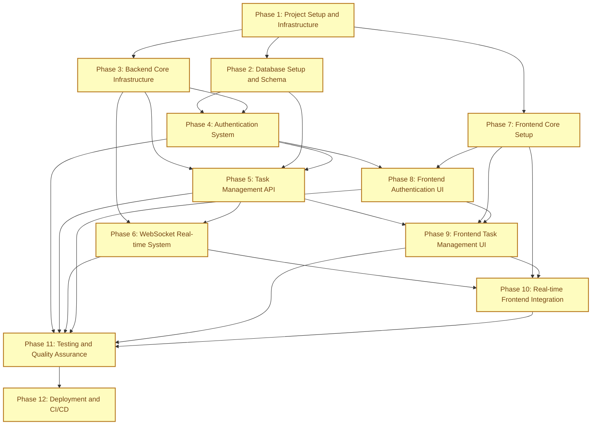

```mermaid
flowchart TD
  Phase1[Phase 1: Project Setup and Infrastructure]:::incomplete --> Phase2[Phase 2: Database Setup and Schema]:::incomplete
  Phase1 --> Phase3[Phase 3: Backend Core Infrastructure]:::incomplete
  Phase1 --> Phase7[Phase 7: Frontend Core Setup]:::incomplete
  
  Phase2 --> Phase4[Phase 4: Authentication System]:::incomplete
  Phase3 --> Phase4
  Phase3 --> Phase5[Phase 5: Task Management API]:::incomplete
  Phase3 --> Phase6[Phase 6: WebSocket Real-time System]:::incomplete
  
  Phase2 --> Phase5
  Phase4 --> Phase5
  Phase4 --> Phase8[Phase 8: Frontend Authentication UI]:::incomplete
  Phase7 --> Phase8
  
  Phase5 --> Phase6
  Phase5 --> Phase9[Phase 9: Frontend Task Management UI]:::incomplete
  Phase7 --> Phase9
  Phase8 --> Phase9
  
  Phase6 --> Phase10[Phase 10: Real-time Frontend Integration]:::incomplete
  Phase7 --> Phase10
  Phase9 --> Phase10
  
  Phase4 --> Phase11[Phase 11: Testing and Quality Assurance]:::incomplete
  Phase5 --> Phase11
  Phase6 --> Phase11
  Phase8 --> Phase11
  Phase9 --> Phase11
  Phase10 --> Phase11
  
  Phase11 --> Phase12[Phase 12: Deployment and CI/CD]:::incomplete

  %% Class Definitions
  classDef incomplete fill:#fefcbf,stroke:#b7791f,stroke-width:2px,color:#744210
  classDef inProgress fill:#bee3f8,stroke:#2b6cb0,stroke-width:2px,color:#2c5282
  classDef complete fill:#c6f6d5,stroke:#2f855a,stroke-width:2px,color:#22543d
``` 