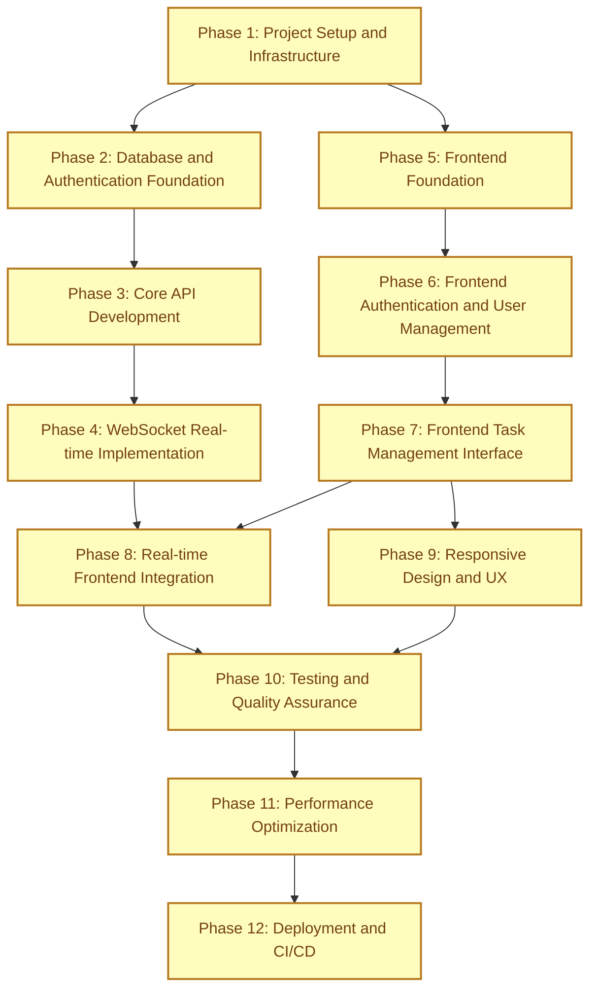

```mermaid
flowchart TD
  Phase1[Phase 1: Project Setup and Infrastructure]:::incomplete --> Phase2[Phase 2: Database and Authentication Foundation]:::incomplete
  Phase1 --> Phase5[Phase 5: Frontend Foundation]:::incomplete
  Phase2 --> Phase3[Phase 3: Core API Development]:::incomplete
  Phase5 --> Phase6[Phase 6: Frontend Authentication and User Management]:::incomplete
  Phase3 --> Phase4[Phase 4: WebSocket Real-time Implementation]:::incomplete
  Phase6 --> Phase7[Phase 7: Frontend Task Management Interface]:::incomplete
  Phase4 --> Phase8[Phase 8: Real-time Frontend Integration]:::incomplete
  Phase7 --> Phase8
  Phase7 --> Phase9[Phase 9: Responsive Design and UX]:::incomplete
  Phase8 --> Phase10[Phase 10: Testing and Quality Assurance]:::incomplete
  Phase9 --> Phase10
  Phase10 --> Phase11[Phase 11: Performance Optimization]:::incomplete
  Phase11 --> Phase12[Phase 12: Deployment and CI/CD]:::incomplete

  %% Class Definitions
  classDef incomplete fill:#fefcbf,stroke:#b7791f,stroke-width:2px,color:#744210
  classDef inProgress fill:#bee3f8,stroke:#2b6cb0,stroke-width:2px,color:#2c5282
  classDef complete fill:#c6f6d5,stroke:#2f855a,stroke-width:2px,color:#22543d
``` 