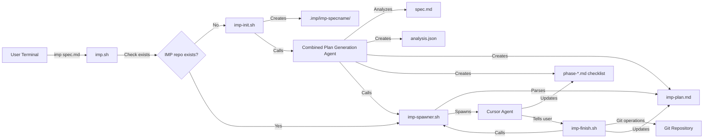
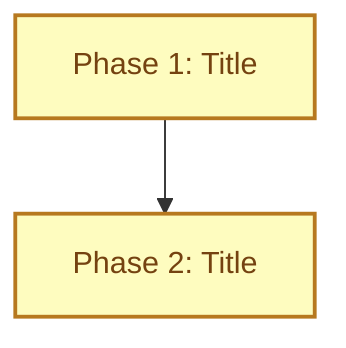

# IMP (Implementation Management Platform) Technical Specification

## 1. Overview

IMP is an automated project implementation system that manages multi-phase technical specifications through intelligent agent orchestration. The system takes a technical specification as input, analyzes the current project state, creates a structured implementation plan with Mermaid flowcharts, and automatically spawns Cursor agents to work on eligible phases while maintaining proper isolation and git workflow management.

**Key Features:**
- Automated spec analysis and phase dependency resolution
- Mermaid-based visual progress tracking with status classes
- Git branch isolation per phase with user approval workflow
- Concurrent phase execution with race condition prevention
- Single source of truth state management via Mermaid diagram

## 2. Architecture Diagram



## 3. API / Protocol

### Script Interfaces

#### imp.sh
```bash
imp.sh <spec-file-path>
```
- Main entry point script
- Checks if IMP repository already exists
- If exists: calls imp-spawner.sh directly
- If not exists: calls imp-init.sh (which then calls imp-spawner.sh)
- Returns: 0 on success, 1 on failure

#### imp-init.sh
```bash
imp-init.sh <spec-file-path>
```
- Creates .imp directory if it doesn't exist
- Creates imp-specname subdirectory based on spec filename
- Spawns combined plan generation agent to analyze spec and create implementation plan
- Returns: 0 on success, 1 on failure

#### imp-spawner.sh
```bash
imp-spawner.sh
```
- Parses imp-plan.md Mermaid diagram
- Identifies phases with `incomplete` status whose dependencies are `complete`
- Spawns Cursor agents for eligible phases
- Updates phase status to `inProgress` in Mermaid diagram
- Returns: 0 on success, 1 on failure

#### imp-finish.sh
```bash
imp-finish.sh <phase-name>
```
- Creates git branch: imp/phase-name
- Commits phase changes
- Pushes to remote
- Updates phase status from `inProgress` to `complete` in imp-plan.md
- Calls imp-spawner.sh to spawn new eligible phases
- Returns: 0 on success, 1 on failure

### Mermaid Status Classes
- `:::incomplete` - Phase not started (default state)
- `:::inProgress` - Phase currently being worked on
- `:::complete` - Phase finished and approved
- `:::failed` - Phase failed (unused for now)

### Cursor Agent Spawning System
The IMP system uses a sophisticated agent spawning mechanism to automate Cursor IDE interactions:

#### Agent Prompt Templates
- `imp-plan-prompt.txt` - Combined plan generation agent for analysis, mermaid, and phase file creation
- `implementation_agent_prompt.txt` - Individual phase implementation agent
- Template-based prompts with variable substitution
- Uses `{SPEC_NAME}` and `{PHASE_NAME}` placeholders
- Provides clear instructions for agent behavior and completion workflow

#### Spawner Script (`spawner.sh`)
- Uses AppleScript to automate Cursor IDE
- Creates new chat tabs programmatically
- Sets clipboard with customized agent prompts
- Supports both manual phase specification and automatic phase detection
- Handles multiple concurrent agents with proper timing

#### Key Features:
- **Dynamic Prompt Generation**: Substitutes variables in prompt templates
- **Automated Cursor Control**: Uses `osascript` to control Cursor IDE
- **Clipboard Integration**: Uses `pbcopy`/`pbpaste` for prompt transfer
- **Concurrent Agent Management**: Spawns multiple agents in separate tabs
- **Phase Detection**: Can automatically detect incomplete phases
- **Logging**: Comprehensive logging for debugging and monitoring

## 4. Output Format Requirements

### Combined Plan Generation Agent Output
The combined plan generation agent (`imp-plan-prompt.txt`) creates two essential files:

#### 1. Analysis JSON (.imp/imp-specname/analysis.json)
```json
{
  "phases": [
    {
      "id": "1",
      "title": "Phase Title",
      "dependencies": [],
      "items": [
        "Item 1 description",
        "Item 2 description",
        "Item 3 description"
      ]
    }
  ]
}
```

#### 2. Mermaid Diagram (.imp/imp-specname/imp-plan.md)
**CRITICAL**: Contains ONLY the Mermaid diagram wrapped in proper mermaid code fences:


## 6. Deployment

### Prerequisites
- Git repository with remote configured
- Cursor IDE with agent capabilities
- Bash shell environment
- Read/write permissions for IMP directories

### Installation
1. Clone IMP repository to local machine
2. Set up git remote configuration
3. Test with sample specification
4. Configure Cursor agent permissions

## 7. Success Criteria

### Functional Requirements
- [ ] Successfully analyze spec and create implementation plan
- [ ] Automatically spawn agents for eligible phases
- [ ] Maintain proper git branch isolation per phase
- [ ] Update Mermaid diagrams with correct status classes
- [ ] Handle concurrent phase execution without conflicts
- [ ] Provide user approval workflow for phase completion
- [ ] Support both sequential and parallel phase dependencies

### Quality Requirements
- [ ] Zero data loss during phase transitions
- [ ] 99% accuracy in dependency resolution
- [ ] Proper error handling for all failure scenarios
- [ ] Clear logging for debugging and monitoring
- [ ] User-friendly error messages and recovery options
