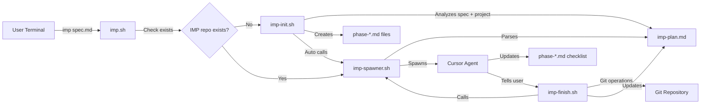

# IMP (Implementation Management Platform) Technical Specification

## 1. Overview

IMP is an automated project implementation system that manages multi-phase technical specifications through intelligent agent orchestration. The system takes a technical specification as input, analyzes the current project state, creates a structured implementation plan with Mermaid flowcharts, and automatically spawns Cursor agents to work on eligible phases while maintaining proper isolation and git workflow management.

**Key Features:**
- Automated spec analysis and phase dependency resolution
- Mermaid-based visual progress tracking with status classes
- Git branch isolation per phase with user approval workflow
- Concurrent phase execution with race condition prevention
- Single source of truth state management via Mermaid diagram

## 2. Architecture Diagram



## 3. API / Protocol

### Script Interfaces

#### imp.sh
```bash
imp.sh <spec-file-path>
```
- Main entry point script
- Checks if IMP repository already exists
- If exists: calls imp-spawner.sh directly
- If not exists: calls imp-init.sh (which then calls imp-spawner.sh)
- Returns: 0 on success, 1 on failure

#### imp-init.sh
```bash
imp-init.sh <spec-file-path>
```
- Analyzes spec.md and current project state
- Generates implementation plan with phases and dependencies
- Creates imp-plan.md with Mermaid flowchart
- Creates phase-*.md files from spec phases
- Automatically calls imp-spawner.sh to start first wave of agents
- Returns: 0 on success, 1 on failure

#### imp-spawner.sh
```bash
imp-spawner.sh
```
- Parses imp-plan.md Mermaid diagram
- Identifies phases with `incomplete` status whose dependencies are `complete`
- Spawns Cursor agents for eligible phases
- Updates phase status to `inProgress` in Mermaid diagram
- Returns: 0 on success, 1 on failure

#### imp-finish.sh
```bash
imp-finish.sh <phase-name>
```
- Creates git branch: imp/phase-name
- Commits phase changes
- Pushes to remote
- Updates phase status from `inProgress` to `complete` in imp-plan.md
- Calls imp-spawner.sh to spawn new eligible phases
- Returns: 0 on success, 1 on failure

### Mermaid Status Classes
- `:::incomplete` - Phase not started (default state)
- `:::inProgress` - Phase currently being worked on
- `:::complete` - Phase finished and approved
- `:::failed` - Phase failed (unused for now)

## 4. Phases & Tasks

### Phase 1: Core Script Development
- [ ] Create imp-init.sh with spec analysis logic
- [ ] Implement project state analysis
- [ ] Create implementation plan generation
- [ ] Implement Mermaid diagram generation from plan
- [ ] Create phase file template system
- [ ] Add directory structure creation
- [ ] Implement spec validation
- [ ] Add error handling and logging

### Phase 2a: Spawner Implementation
- [ ] Create imp-spawner.sh core spawning logic
- [ ] Implement Mermaid parsing with regex
- [ ] Add dependency resolution algorithm
- [ ] Create phase eligibility checking
- [ ] Implement status class updates
- [ ] Add concurrent phase safety checks
- [ ] Create Cursor agent spawning
- [ ] Add agent prompt generation

### Phase 2b: Git Integration System
- [ ] Create imp-finish.sh git operations
- [ ] Implement branch creation logic
- [ ] Add change detection and staging
- [ ] Create commit message generation
- [ ] Implement push to remote
- [ ] Add conflict detection
- [ ] Create rollback mechanisms
- [ ] Add git status validation

### Phase 3: User Interface Integration
- [ ] Create Cursor UI approval dialog
- [ ] Implement change summary generation
- [ ] Add approval workflow integration
- [ ] Create progress visualization
- [ ] Implement real-time status updates
- [ ] Add manual phase management
- [ ] Create error reporting interface
- [ ] Add user preference configuration

### Phase 4: Testing and Validation
- [ ] Create unit tests for all scripts
- [ ] Implement integration test suite
- [ ] Add Mermaid parsing validation
- [ ] Create git workflow testing
- [ ] Implement agent isolation testing
- [ ] Add concurrent execution testing
- [ ] Create error scenario testing
- [ ] Add performance benchmarking

## 5. Deployment

### Prerequisites
- Git repository with remote configured
- Cursor IDE with agent capabilities
- Bash shell environment
- Read/write permissions for IMP directories

### Installation
1. Clone IMP repository to local machine
2. Set up git remote configuration
3. Test with sample specification
4. Configure Cursor agent permissions

## 6. Success Criteria

### Functional Requirements
- [ ] Successfully analyze spec and create implementation plan
- [ ] Automatically spawn agents for eligible phases
- [ ] Maintain proper git branch isolation per phase
- [ ] Update Mermaid diagrams with correct status classes
- [ ] Handle concurrent phase execution without conflicts
- [ ] Provide user approval workflow for phase completion
- [ ] Support both sequential and parallel phase dependencies

### Quality Requirements
- [ ] Zero data loss during phase transitions
- [ ] 99% accuracy in dependency resolution
- [ ] Proper error handling for all failure scenarios
- [ ] Clear logging for debugging and monitoring
- [ ] User-friendly error messages and recovery options
