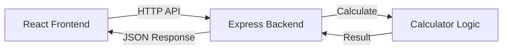

# Simple Calculator App - Technical Specification

## 1. Overview

A web-based calculator application with React frontend and Node.js backend. This project demonstrates concurrent development of frontend and backend components.

**Key Features:**
- Basic arithmetic operations (add, subtract, multiply, divide)
- React frontend with modern UI
- Node.js/Express backend API
- Real-time calculation display
- Input validation and error handling

## 2. Architecture Diagram



## 3. Technology Stack

### Frontend
- React 18 with TypeScript
- CSS for styling (no external UI libraries)
- Fetch API for HTTP requests

### Backend
- Node.js with Express
- TypeScript
- Basic error handling

### Development
- No database required
- No authentication
- Simple file-based setup

## 4. Requirements

### Frontend Features
- [ ] Calculator UI with number buttons (0-9)
- [ ] Operation buttons (+, -, *, /)
- [ ] Clear and equals buttons
- [ ] Display current calculation and result
- [ ] Responsive design for mobile/desktop
- [ ] Error message display

### Backend Features
- [ ] REST API endpoint for calculations
- [ ] Input validation
- [ ] Division by zero error handling
- [ ] JSON response format
- [ ] CORS configuration for frontend

### Technical Requirements
- [ ] Frontend runs on port 3000
- [ ] Backend runs on port 3001
- [ ] API endpoint: POST /api/calculate
- [ ] No external dependencies beyond React/Express
- [ ] TypeScript for type safety

## 5. Configuration

### Frontend Environment
```yaml
REACT_APP_API_URL: http://localhost:3001
```

### Backend Environment
```yaml
PORT: 3001
CORS_ORIGIN: http://localhost:3000
```

## 6. Success Criteria

### Functional Requirements
- [ ] Calculator accepts input via UI buttons
- [ ] All four operations work correctly
- [ ] Backend validates input and handles errors
- [ ] Frontend displays results and errors
- [ ] Both servers start without errors

### Quality Requirements
- [ ] Code is readable and well-commented
- [ ] Error handling on both frontend and backend
- [ ] Responsive design works on different screen sizes
- [ ] API follows REST conventions 